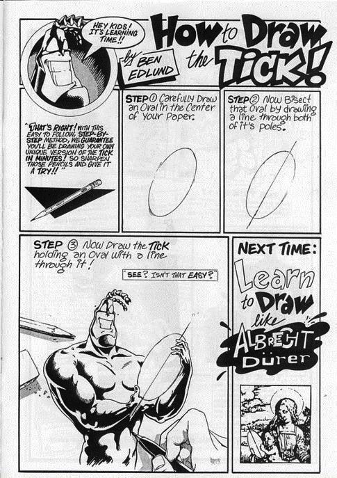

# Counter Lab

> This lab is designed to help you seal in what we did yesterday, and is great as a "kata" for practicing the "moves" in state management using signals and the signal store.


In this lab you we recreate what we already did in the `signalsdemos` with the counter and the prefs.

## Sprint 1 - Feature Scaffold

Add the `lucideClock` icon to the `icons` type at `src/app/areas/shared/ui-common/icons/types.ts` (make sure it is imported, too).

In your terminal, in the project root, run the following:

```bash
ng generate feature-landing counter --title="Counter" --icon="lucideClock"
```

This creates the feature folder structure and wires it into the app's routes and navigation automatically.

### Check Your Work

Start the app (`npm start`) and navigate to `http://localhost:4200`. You should see the 'counter' link, and be able to follow it and see the default page.

---

## Sprint 2 - Counter Page 

Add a new file at `src/app/areas/counter/counter-landing/internal/pages` called 'counter.ts'.

In that file use the `ngp` snippet to generate the following (tabbing to replace the placeholders):


```ts
import { Component} from '@angular/core';
import { PageLayout } from '@ht/shared/ui-common/layouts/page';

@Component({
  selector: 'app-home-pages-counter',
  providers: [],
  imports: [PageLayout],
  template: `<app-ui-page title="Counter">
    <div>
      <button class="btn btn-circle btn-warning">
        -
      </button>
      <span class="text-3xl p-4">0</span>

      <button  class="btn btn-circle btn-success">
      +
      </button>
    </div>

    <div class="p-8">
      <button>
        Reset
      </button>
    </div>
  </app-ui-page>`,
  styles: ``,
})
export class CounterPage {

}
```

Since you have the code from class, I'll just provide the "sequence" of requirements here.

This is a "kata" or practice, helping you train yourself to understand signals, state flow, and "lifting state". You already *know* how to do this, because you did it yesterday or watched me do it (and you have the code from yesterday, either in your own project, or the instructor's code if you get stuck). 

Do not just "copy and paste", though - you won't learn much that way, probably. 

At each "sprint" below, pretend as if you don't know what is coming next. Ask yourself the question "what is the simplest thing I can do to meet the requirements of this sprint".

**You are doing this to learn something, not *accomplish* something!**

## Sprint 1 - Routing and a Link

Add the `counter.ts` as a route to the `counter.routes.ts` file.

In the `/src/app/areas/counter/home.ts` add a link to the signal array in the component to display a link to your new component.

Check your work in the browser.

## Sprint 2 - Make the Counter "Work"

Implement the increment and decrement buttons, using a signal to hold the current value so that the user and add and subtract a 1 from the value with each click.

Make the Reset button reset the count to 0.

The reset button should be disabled if we are already at the "reset state" - e.g., current is 0.

## Sprint 3 - Fizz Buzz

Create a new component in the counter area called "fizzbuzz" (create a file called "fizzbuzz.ts").

You can use the `ngc` snippet to start your component.

The selector should be `app-counter-fizzbuzz`.

Provide a signal input that allows the Counter component to provide the current value to this component.

Create an UI better than the one I did yesterday to display the "fizzbuzz" status of the current value.

(you can look at the DaisyUi website for components and styling that bring you joy.)

Use this as a child component of the Counter component.

## Sprint 4 - User Preferences

Create a new page in the Counter area called `prefs.ts`. (use the `ngp` snippet). 

Create a new route and a link, as we did above for the counter so the user can get to the "prefs" page.

Concoct a signals-based UI that allows the user to specify if they want to count by 1, 3, or 5.

(you could try to build a UI different than what I did yesterday if you are feeling saucy.)

Make it "work" on it's own. 

## Sprint 5 - Draw the Rest of the Tick



The prefs page "works", but it doesn't "do anything". It has no impact on the counter.

The need to have some shared state. That is what services are for.

Create a service using the Signal Store (`createSignalStore` function) with just enough "state" to hold what we are counting by, and have the prefs component set that state on the store, by injecting the store, and using a method on the store you create.

**Hint**: You will need to `provide` the store. I recommend adding it to the provider's array on the `counter.routes.ts` file.

**Question for Contemplation**: What does it mean to "provide a service"? What is the difference between providing a service on a component, on a route, or in the "global" providers of the `app.config.ts`'s  providers array?

Inject the same service into the counter component and use the value set in the prefs to change how the counter is incrementing and decrementing.

This is better, but the counter is losing it's state (the value of the current signal) when you leave the component to change the preferences.

What are some ways you could solve this? How did we solve it yesterday? 

Implement whichever way you'd like to explore.


